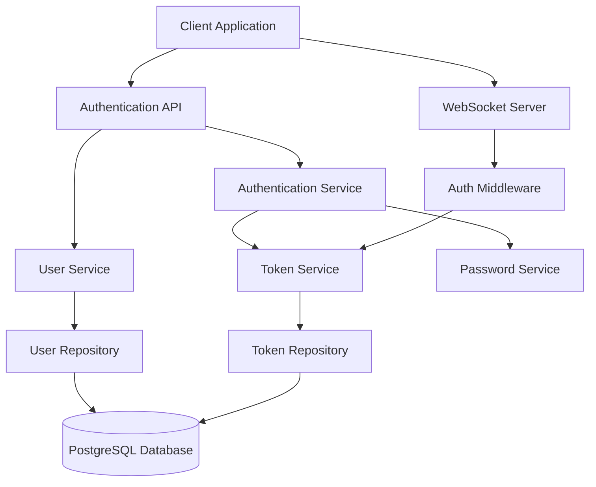

# Authentication System Design

## Overview

The authentication system will be built as a modular, secure solution using JWT tokens with refresh token rotation. The architecture follows industry best practices including secure password hashing, token-based authentication, and comprehensive input validation. The system integrates seamlessly with the existing Prisma/PostgreSQL stack and provides both HTTP API endpoints and WebSocket authentication capabilities.

## Architecture

### High-Level Architecture



### Security Architecture

- **Password Security**: bcrypt hashing with 12+ rounds
- **Token Security**: JWT with RS256 signing, short-lived access tokens (15 min), longer refresh tokens (7 days)
- **Token Rotation**: Refresh tokens are rotated on each use
- **Rate Limiting**: Login attempts and token refresh requests
- **Input Validation**: Comprehensive validation using Zod schemas

## Components and Interfaces

### 1. Database Models (Prisma Schema Extensions)

```typescript
// User model extension
model User {
  id          String   @id @default(cuid())
  email       String   @unique
  password    String
  firstName   String?
  lastName    String?
  isActive    Boolean  @default(true)
  createdAt   DateTime @default(now())
  updatedAt   DateTime @updatedAt
  lastLoginAt DateTime?

  refreshTokens RefreshToken[]

  @@map("users")
}

model RefreshToken {
  id        String   @id @default(cuid())
  token     String   @unique
  userId    String
  expiresAt DateTime
  createdAt DateTime @default(now())
  isRevoked Boolean  @default(false)

  user User @relation(fields: [userId], references: [id], onDelete: Cascade)

  @@map("refresh_tokens")
}
```

### 2. Core Services

#### AuthenticationService

```typescript
interface AuthenticationService {
  register(
    email: string,
    password: string,
    firstName?: string,
    lastName?: string
  ): Promise<AuthResult>;
  login(email: string, password: string): Promise<AuthResult>;
  refreshTokens(refreshToken: string): Promise<AuthResult>;
  logout(refreshToken: string): Promise<void>;
  revokeAllTokens(userId: string): Promise<void>;
}

interface AuthResult {
  user: PublicUser;
  accessToken: string;
  refreshToken: string;
}
```

#### TokenService

```typescript
interface TokenService {
  generateAccessToken(userId: string, email: string): string;
  generateRefreshToken(): string;
  verifyAccessToken(token: string): Promise<TokenPayload>;
  storeRefreshToken(userId: string, token: string): Promise<void>;
  validateRefreshToken(token: string): Promise<RefreshTokenData>;
  revokeRefreshToken(token: string): Promise<void>;
  rotateRefreshToken(oldToken: string, userId: string): Promise<string>;
}
```

#### PasswordService

```typescript
interface PasswordService {
  hashPassword(password: string): Promise<string>;
  verifyPassword(password: string, hash: string): Promise<boolean>;
  validatePasswordStrength(password: string): ValidationResult;
}
```

### 3. API Endpoints

#### Authentication Routes (`/api/auth`)

- `POST /register` - User registration
- `POST /login` - User login
- `POST /refresh` - Token refresh
- `POST /logout` - User logout
- `POST /logout-all` - Revoke all user tokens

#### User Management Routes (`/api/users`)

- `GET /profile` - Get user profile (protected)
- `PUT /profile` - Update user profile (protected)
- `PUT /password` - Change password (protected)
- `DELETE /account` - Delete account (protected)

### 4. Middleware Components

#### Authentication Middleware

```typescript
interface AuthMiddleware {
  requireAuth(req: Request, res: Response, next: NextFunction): Promise<void>;
  optionalAuth(req: Request, res: Response, next: NextFunction): Promise<void>;
  extractUser(token: string): Promise<User | null>;
}
```

#### WebSocket Authentication

```typescript
interface WebSocketAuth {
  authenticateConnection(socket: Socket, token: string): Promise<boolean>;
  attachUserToSocket(socket: Socket, user: User): void;
}
```

## Data Models

### User Data Transfer Objects

```typescript
interface RegisterRequest {
  email: string;
  password: string;
  firstName?: string;
  lastName?: string;
}

interface LoginRequest {
  email: string;
  password: string;
}

interface RefreshRequest {
  refreshToken: string;
}

interface PublicUser {
  id: string;
  email: string;
  firstName?: string;
  lastName?: string;
  createdAt: Date;
  lastLoginAt?: Date;
}

interface TokenPayload {
  userId: string;
  email: string;
  iat: number;
  exp: number;
}
```

### Validation Schemas (Zod)

```typescript
const registerSchema = z.object({
  email: z.string().email(),
  password: z.string().min(8).max(128),
  firstName: z.string().min(1).max(50).optional(),
  lastName: z.string().min(1).max(50).optional(),
});

const loginSchema = z.object({
  email: z.string().email(),
  password: z.string().min(1),
});
```

## Error Handling

### Error Types

- `AuthenticationError` - Invalid credentials, expired tokens
- `ValidationError` - Input validation failures
- `ConflictError` - Email already exists
- `NotFoundError` - User not found
- `RateLimitError` - Too many requests

### Error Response Format

```typescript
interface ErrorResponse {
  error: {
    code: string;
    message: string;
    details?: Record<string, string[]>;
  };
}
```

### Security Error Handling

- Generic error messages to prevent user enumeration
- Rate limiting on authentication endpoints
- Secure logging without exposing sensitive data

## Testing Strategy

### Unit Testing

- Service layer testing with mocked dependencies
- Password hashing and verification
- Token generation and validation
- Input validation schemas

### Integration Testing

- Database operations with test database
- API endpoint testing with supertest
- Authentication middleware testing
- WebSocket authentication flow

### Security Testing

- Password strength validation
- Token expiration and rotation
- Rate limiting effectiveness
- SQL injection prevention
- XSS prevention in responses

### Test Data Management

- Factory functions for test user creation
- Database seeding and cleanup
- Mock JWT tokens for testing
- Test environment configuration

## Security Considerations

### Password Security

- bcrypt with minimum 12 rounds
- Password strength requirements
- Secure password reset flow
- Prevention of password reuse

### Token Security

- Short-lived access tokens (15 minutes)
- Refresh token rotation
- Secure token storage recommendations
- Token revocation capabilities

### API Security

- Rate limiting on authentication endpoints
- CORS configuration
- Request size limits
- Input sanitization

### Database Security

- Parameterized queries (Prisma handles this)
- Connection string security
- Database user permissions
- Audit logging for sensitive operations

## Performance Considerations

### Caching Strategy

- JWT verification caching
- User data caching for frequent lookups
- Rate limiting state storage

### Database Optimization

- Indexes on email and token fields
- Connection pooling configuration
- Query optimization for user lookups

### Scalability

- Stateless authentication design
- Horizontal scaling support
- Load balancer session affinity not required
